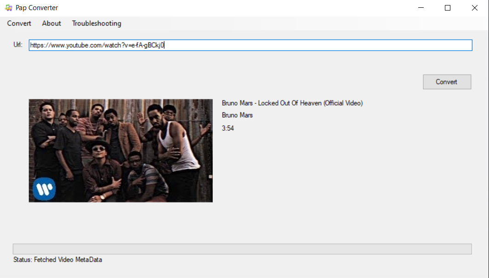

# Youtube-Downloader-And-Converter
Pap Converter is here to help you download and convert youtube videos

This program has been created to help you download and convert videos you like from youtube with ease.
You can choose the convert type (Audio, Video) and the file Mimepipe (mp3, mp4). You can select where to store the converted file.
The convertion of the file should not take too much time depending on your machine. The only time consuming operation is the download process but you don't have to worry since we added a progress bar to let you know what is going on.

You can view and you are welcome to edit the source code and even contribute.
We are planning on updating the program to add more mimepipes support for audio as well for video.

This project uses open source libraries to achieve its goal. 
1)Youtube Explode
2)Xabe.FFmpeg
3)TagLibSharp

Updated Libraries and Exception Handling

## In case you have issues with the Updater and always suggests there are no updates available, we are aware of this issue and we just fixed it.
#### You can manually patch the Updater by downloading the latest update from [Update.exe](setup/Update/Update.exe) and install the patch.
